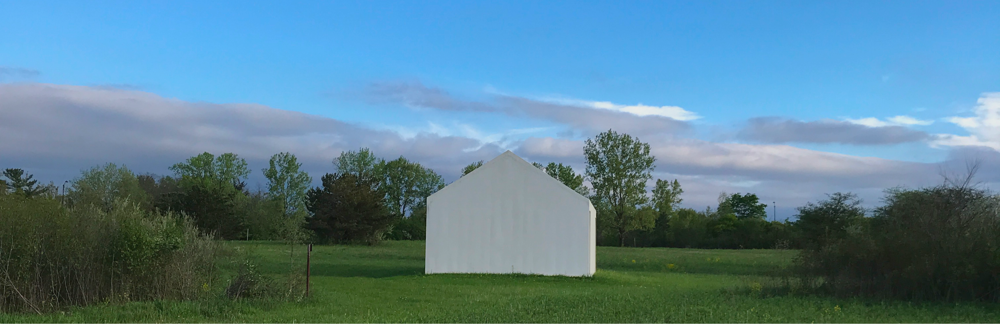

# And c. shike is a musician, artist, & coder from the American midwest

## Designer at [studio ampersands](https://ampersands.space/)

## Makes music as [andrew cs](https://andrewcs.bandcamp.com/)

 

## Sounds + Images

-   [time-find.ing](https://time-find.ing) _2023 – now_
-   [caught in pointers](https://leavingrecords.com/caught-in-pointers) _2024_
-   [caught in pointers (the exhibition)](https://pointers.space/) _2024_
-   [nimi](https://cached.media/nimi) _2022_
-   [\*](https://leavingrecords.com/asterisk) _2021_
-   [transition spaces](https://andrewcs.bandcamp.com/album/transition-spaces) _2020_
-   [m p k m c](https://andrewcs.bandcamp.com/album/m-p-k-m-c) _2019_

 

## Code + Objects

-   [wrld](./pages/wrld) _2020 – now_
-   [open source furniture](./pages/furniture) _2022 – now_
-   [prosody](https://github.com/andr-ew/prosody) _2019_

 

## Sometimes uses internet [bandcamp](https://andrewcs.bandcamp.com/), [spotify](https://open.spotify.com/artist/7Fv7NaEJyV1PKy9PURdZFx), [bluesky](https://bsky.app/profile/and-cs.bsky.social), [pixelfed](https://pixelfed.social/and-cs), [youtube](https://www.youtube.com/@andrewcs_), [instagram](https://instagram.com/_and.rew__), [are.na](https://www.are.na/andrew-cs), [soundcloud](https://soundcloud.com/a-ndrewcs)

## Would like u to email them [and-cs@pm.me](mailto:and-cs@pm.me)

 

:>

-&
