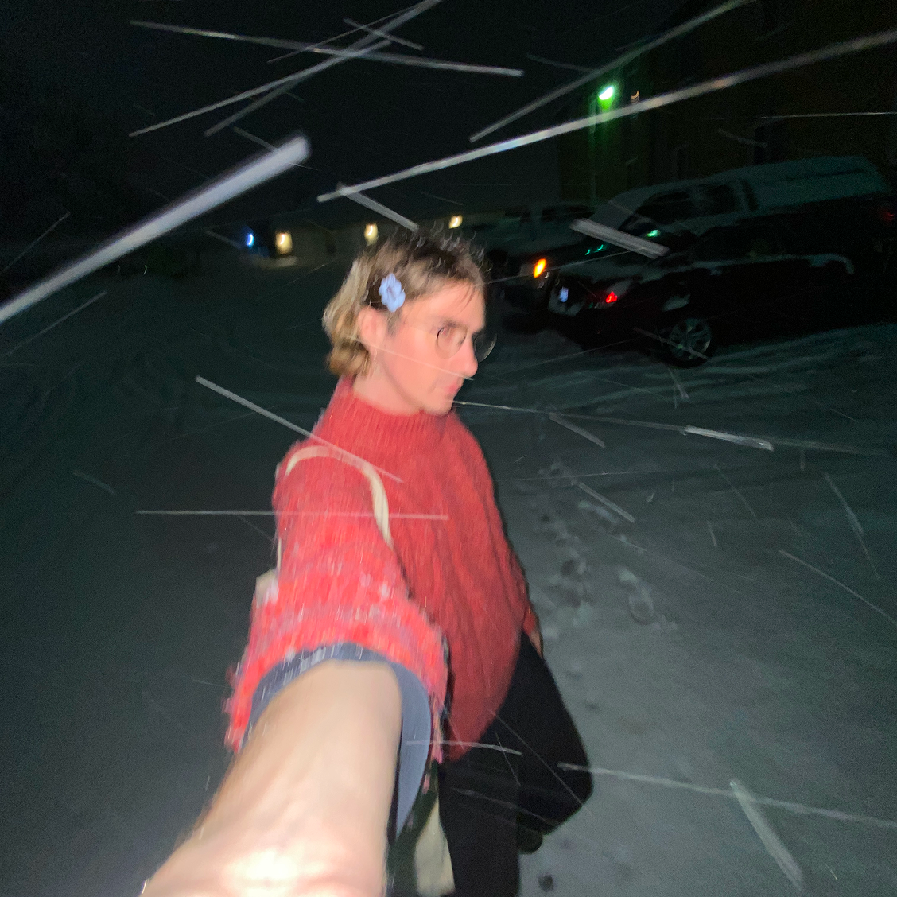

# and c. shike is a visual artist, musician, and game developer on the autism spectrum, originally from the american midwest. their work explores autistic differences in long term memory, interpersonal connections, pattern recognition, fixation, and sensory experience through the lens of new + old media.

Their music has been released by [leaving records](https://leavingrecords.com) and [cached media](https://cached.media). Their visual art has been in exhibitions presented by [waiting room](https://waitingroomart.com/) and open space.
 

## Press

-   [Interview](https://jbushnell.substack.com/p/wednesday-investigations-213-andrew) with the wednesday investigations _2024_
-   [\* EP review](https://chicagoreader.com/music/chicago-ambient-musician-andrew-cs-harnesses-the-tranquility-of-nature-on-his-new-ep/), chicago reader _2021_
-   [Interview](https://open.spotify.com/episode/03abFbyiNDq0raEnpuwpXV) on art + music + technology _2019_
